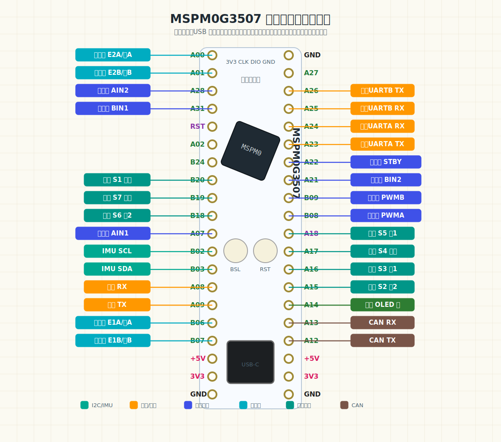

# MSPM0G3507 Seven-Channel Line Tracking Car

基于 TI MSPM0G3507 的七路数字循迹小车工程，使用 CCS Theia、SysConfig 和 DriverLib 开发。工程包含双电机 PWM 驱动、左右编码器测速、速度 PID、七路循迹加权误差计算、直角弯增强和 10ms 周期控制中断。

默认运行模式为循迹闭环，适合 TB6612 类双路电机驱动板、带编码器减速电机和七路数字循迹模块。

## 功能特性

- MSPM0G3507 原生 DriverLib 工程
- 七路数字循迹输入，支持 `S1` 到 `S7`
- 循迹权重：`{50, 33, 16, 0, -16, -33, -50}`
- 直角弯增强识别：
  - `S1~S4` 同时触发：左直角弯
  - `S4~S7` 同时触发：右直角弯
- 双电机独立控制
- 左电机使用 TIMG8 QEI 硬件正交解码
- 右电机使用 GPIO 双边沿中断软件正交解码
- PWM 范围保持 `0..3199`
- 10ms 定时控制周期
- 支持四种运行模式：
  - `0`：禁用停车
  - `1`：开环 PWM
  - `2`：速度 PID
  - `3`：循迹闭环
- 保留 `g_car` 和 `g_line` 全局调试变量，方便 Ozone / CCS 观察和在线调参
- 支持 JDY-31-SPP / HC-05 蓝牙串口调试，可用 VOFA+ 实时查看曲线并在线修改 PID 参数

## 硬件连接

### 七路循迹模块

按小车前进方向定义左右：站在车尾看向车头，最左边探头为 `S1`，中间探头为 `S4`，最右边探头为 `S7`。

| 循迹通道 | MSPM0G3507 引脚 | 说明 |
|---|---|---|
| S1 | PA15 | 最左侧探头 |
| S2 | PA16 | 左侧探头 |
| S3 | PA17 | 左中探头 |
| S4 | PB18 | 中间探头 |
| S5 | PB19 | 右中探头 |
| S6 | PB20 | 右侧探头 |
| S7 | PB24 | 最右侧探头 |

循迹输入在 SysConfig 中配置为输入上拉。`g_line.active_low` 默认值为 `0`，即信号高电平表示检测到黑线或有效状态。如果你的循迹模块输出逻辑相反，可以在调试时把 `g_line.active_low` 改为 `1`。

循迹模块供电按模块要求接 5V 或 3.3V，但进入 MSPM0G3507 的信号必须不超过 3.3V。循迹模块、开发板、电机驱动和电池必须共地。

### 电机驱动与编码器

| 驱动板接口 | MSPM0G3507 引脚 | 说明 |
|---|---|---|
| PWMA | PB8 | 左电机 PWM，TIMA0.CCP0 |
| AIN1 | PA7 | 左电机方向 1 |
| AIN2 | PA28 | 左电机方向 2 |
| STBY | PA22 | TB6612 使能，高电平工作 |
| BIN1 | PA31 | 右电机方向 1 |
| BIN2 | PA21 | 右电机方向 2 |
| PWMB | PB9 | 右电机 PWM，TIMA0.CCP1 |
| E1A | PB6 | 左编码器 A 相，TIMG8 QEI |
| E1B | PB7 | 左编码器 B 相，TIMG8 QEI |
| E2A | PA0 | 右编码器 A 相，GPIO 中断 |
| E2B | PA1 | 右编码器 B 相，GPIO 中断 |
| GND | GND | 必须共地 |

### 蓝牙串口模块

工程使用 `UART1` 作为蓝牙调试串口，适合 JDY-31-SPP、HC-05 这类透明串口蓝牙模块。

| 蓝牙模块 | MSPM0G3507 引脚 | 说明 |
|---|---|---|
| TXD | PA9 | 蓝牙发送，接 MCU 的 `UART1_RX` |
| RXD | PA8 | 蓝牙接收，接 MCU 的 `UART1_TX` |
| GND | GND | 必须共地 |
| VCC | 3.3V | 按模块要求供电 |

串口参数：

- 波特率：`9600`
- 数据位：`8`
- 校验位：无
- 停止位：`1`
- 硬件流控：无

注意蓝牙模块的 `TXD` 要接 MCU 的 `RX`，蓝牙模块的 `RXD` 要接 MCU 的 `TX`。如果串口助手只能看到自己发送的内容，看不到 MCU 回复，优先检查交叉接线、共地和模块串口波特率。

电机动力线接驱动板白色电机接口：

- `MOTOR-A` 接左电机
- `MOTOR-B` 接右电机

如果电机方向或编码器方向与期望相反，优先通过下面变量调节：

- `g_car.left.invert_motor`
- `g_car.left.invert_encoder`
- `g_car.right.invert_motor`
- `g_car.right.invert_encoder`

默认值：

```c
g_car.left.invert_motor = 1;
g_car.left.invert_encoder = 0;
g_car.right.invert_motor = 1;
g_car.right.invert_encoder = 1;
```

## 工程结构

| 文件 | 说明 |
|---|---|
| `empty.c` | 主函数、初始化顺序、10ms 定时中断入口 |
| `empty.syscfg` | MSPM0G3507 引脚、PWM、QEI、GPIO 中断和定时器配置 |
| `car_control.c` | 电机控制、速度 PID、循迹闭环、编码器读取、PWM/方向输出 |
| `car_control.h` | 小车控制结构体、模式枚举和公共接口 |
| `line_tracker.c` | 七路循迹采样、加权误差、直角弯识别 |
| `line_tracker.h` | 循迹结构体和公共接口 |
| `debug_uart.c` | 蓝牙 UART、VOFA+ JustFloat 曲线发送、在线 PID 调参命令 |
| `debug_uart.h` | 蓝牙调试接口声明 |

## 初始化流程

主程序初始化顺序：

```c
SYSCFG_DL_init();
LineTracker_Init();
Car_Init();
```

随后写入默认运行参数：

```c
g_car.left.pid.kp = 180;
g_car.left.pid.ki = 0.35f;
g_car.left.pid.kd = 26;

g_car.right.pid.kp = 180;
g_car.right.pid.ki = 0.28f;
g_car.right.pid.kd = 18;

g_car.left.target_counts = 26;
g_car.right.target_counts = 26;
g_car.mode = CAR_MODE_LINE_FOLLOW;
```

控制周期由 `TIMG12` 产生，周期为 10ms。每次中断调用：

```c
Car_ControlStep();
```

## 控制变量

### `g_car`

`g_car` 是小车主控制变量，可用于观察状态和在线调参。

常用字段：

| 字段 | 说明 |
|---|---|
| `g_car.mode` | 当前运行模式 |
| `g_car.control_tick` | 10ms 控制周期计数 |
| `g_car.driver_enabled` | 驱动使能状态 |
| `g_car.left.target_counts` | 左轮目标编码器增量 |
| `g_car.right.target_counts` | 右轮目标编码器增量 |
| `g_car.left.measured_counts` | 左轮实测编码器增量 |
| `g_car.right.measured_counts` | 右轮实测编码器增量 |
| `g_car.left.pwm_output` | 左轮最终 PWM 输出 |
| `g_car.right.pwm_output` | 右轮最终 PWM 输出 |
| `g_car.line.base_counts` | 循迹基础速度 |
| `g_car.line.correction_counts` | 循迹修正量 |
| `g_car.line.left_target_counts` | 循迹计算后的左轮目标 |
| `g_car.line.right_target_counts` | 循迹计算后的右轮目标 |

### `g_line`

`g_line` 是循迹模块状态变量。

常用字段：

| 字段 | 说明 |
|---|---|
| `g_line.raw_mask` | 原始输入位图 |
| `g_line.active_mask` | 有效循迹位图 |
| `g_line.active_count` | 当前触发探头数量 |
| `g_line.line_seen` | 是否检测到线 |
| `g_line.error` | 当前循迹误差 |
| `g_line.sample_tick` | 循迹采样计数 |
| `g_line.active_low` | 是否低电平有效 |
| `g_line.right_angle_detected` | 是否检测到直角弯 |
| `g_line.right_angle_direction` | 直角弯方向，`1` 左，`-1` 右 |

单个探头触发时的默认误差：

| 通道 | `active_mask` | `error` |
|---|---:|---:|
| S1 | `0x01` | `50` |
| S2 | `0x02` | `33` |
| S3 | `0x04` | `16` |
| S4 | `0x08` | `0` |
| S5 | `0x10` | `-16` |
| S6 | `0x20` | `-33` |
| S7 | `0x40` | `-50` |

## 编译与下载

开发环境：

- CCS Theia
- MSPM0 SDK
- SysConfig
- TI Arm Clang
- MSPM0G3507 开发板

使用方法：

1. 用 CCS Theia 打开工程文件夹。
2. 确认 SysConfig 中芯片为 `MSPM0G3507`，封装为 `LQFP-64(PM)`。
3. 编译 Debug 配置。
4. 下载到开发板。
5. 打开 Ozone 或 CCS 调试窗口，观察 `g_car` 和 `g_line`。

## 上板验证

### 静态验证

1. 设置 `g_car.mode = 0`。
2. 确认：
   - `STBY = 0`
   - 左右 PWM 为 0
   - `AIN1/AIN2/BIN1/BIN2` 全为低电平
3. 依次遮挡 `S1..S7`，确认：
   - `g_line.active_mask` 分别为 `1,2,4,8,16,32,64`
   - `g_line.error` 分别为 `50,33,16,0,-16,-33,-50`
4. 同时触发 `S1~S4`，确认左直角弯增强。
5. 同时触发 `S4~S7`，确认右直角弯增强。

### 架空动态验证

将小车架空，避免车轮接触地面。

1. 确认 `g_car.control_tick` 每秒约增加 100。
2. 确认 `g_line.sample_tick` 每秒约增加 100。
3. 设置 `g_car.mode = 1`，测试开环 PWM 输出。
4. 设置 `g_car.mode = 2`，给左右轮正的 `target_counts`，确认：
   - 两个轮子朝前转
   - `measured_counts` 为正
5. 若方向不对，调整：
   - `invert_motor`
   - `invert_encoder`
6. 设置 `g_car.mode = 3`，测试循迹闭环：
   - `S1` 触发时，`right_target_counts > left_target_counts`
   - `S7` 触发时，`left_target_counts > right_target_counts`

## 调参建议

### 使用的软件

推荐同时准备两个软件：

| 软件 | 用途 |
|---|---|
| VOFA+ | 接收 JustFloat 二进制数据，实时显示速度环和循迹环曲线 |
| 串口助手 | 发送 ASCII 调参命令，例如 `LP 120`、`MSPD 120 0.05 0 120 0.05 0` |

如果 VOFA+ 正在打开蓝牙 COM 口，串口助手通常不能同时打开同一个 COM 口。可以用下面两种方式：

1. 使用 VOFA+ 的发送区直接发送调参命令。
2. 先关闭 VOFA+ 串口，用串口助手发送命令，再回到 VOFA+ 看曲线。

当前代码已经做了保护：`VOFA ON` 正在持续发送 JustFloat 数据时，MCU 仍然会解析调参命令，但不会回传 `OK` 或 `ERR` 文本，避免文本混进 JustFloat 数据流导致曲线异常。`VOFA OFF` 后发送命令，MCU 会恢复普通文本确认回复。

### 蓝牙调试模式开关

蓝牙调 PID 和 VOFA+ 曲线由编译期开关 `CAR_DEBUG_MODE` 控制。这个开关在 [debug_uart.h](debug_uart.h) 里，当前需要修改的位置是第 24 行附近：

```c
#define CAR_DEBUG_MODE   DEBUG_MODE_OFF
```

如果要切换模式，只改这一行，然后重新编译、下载程序。

三种可选模式定义在同一个文件中：

```c
#define DEBUG_MODE_OFF   0U
#define DEBUG_MODE_CMD   1U
#define DEBUG_MODE_VOFA  2U
```

#### 比赛模式：关闭全部蓝牙调试

比赛前建议改成：

```c
#define CAR_DEBUG_MODE   DEBUG_MODE_OFF
```

这个模式下：

- 不解析蓝牙命令。
- 不发送 `OK`、`ERR`、`SHOW` 等文本。
- 不发送 VOFA+ JustFloat 曲线。
- `Debug_UART_Task()` 基本直接返回，避免串口发送、命令解析和阻塞风险。
- 蓝牙串口发送任何命令都没有反应，这是正常现象。
- 小车循迹、速度 PID、电机控制仍按主程序正常运行。

#### 命令调参模式：只用蓝牙改参数

如果只想用串口助手或 VOFA+ 发送区修改 PID，不需要实时曲线，改成：

```c
#define CAR_DEBUG_MODE   DEBUG_MODE_CMD
```

这个模式下：

- 可以发送 `LP`、`LI`、`LD`、`RP`、`RI`、`RD` 修改速度 PID。
- 可以发送 `P`、`I`、`D`、`BASE`、`LINEPID` 修改循迹 PID 和基础速度。
- 可以发送 `SHOW` 查看当前参数。
- 可以发送 `START`、`STOP`、`SPDSET` 等控制命令。
- MCU 会回复少量文本，例如 `OK LP=120.000`、`ERR LP`、`SHOW` 参数内容。
- 不会发送 VOFA+ JustFloat 曲线；即使发送 `VOFA ON`，也不会开始曲线输出。

适合调完参数后做低风险验证，因为没有持续二进制曲线数据占用串口。

#### 完整调试模式：蓝牙调参 + VOFA+ 曲线

如果要一边看 VOFA+ 曲线一边在线修改 PID，改成：

```c
#define CAR_DEBUG_MODE   DEBUG_MODE_VOFA
```

这个模式下：

- 可以接收所有蓝牙调参命令。
- 可以发送 VOFA+ JustFloat 曲线。
- 可以用 `TEST ON`、`SPD ON`、`LINE ON`、`PID ON` 切换曲线内容。
- `VOFA OFF` 时发送命令会有 `OK/ERR/SHOW` 文本回复。
- `VOFA ON` 时发送 `LP`、`RP`、`BASE`、`MSPD` 等命令仍会生效，但不会回复文本，避免文本混进 JustFloat 数据流导致曲线错位。

完整调试模式的典型流程：

```text
SPD ON
VOFA ON
LP 120
RP 120
MSPD 120 0.05 0 120 0.05 0
BASE 15
```

如果需要查看参数文本，先停止曲线：

```text
VOFA OFF
SHOW
```

模式切换总结：

| 目标 | 修改第 24 行为 |
|---|---|
| 比赛运行，彻底关闭蓝牙调试 | `#define CAR_DEBUG_MODE   DEBUG_MODE_OFF` |
| 只用蓝牙命令调 PID，不看曲线 | `#define CAR_DEBUG_MODE   DEBUG_MODE_CMD` |
| 蓝牙命令调 PID，同时用 VOFA+ 看曲线 | `#define CAR_DEBUG_MODE   DEBUG_MODE_VOFA` |

### VOFA+ 设置

1. 电脑蓝牙连接 `JDY-31-SPP` 或 `HC-05`，记下对应的 COM 口。
2. 打开 VOFA+。
3. 串口选择蓝牙对应的 COM 口。
4. 波特率选择 `9600`。
5. DataEngine / 协议选择 `JustFloat`。
6. 通道数选择 `8`。
7. 打开串口。

JustFloat 每帧固定发送 `8` 个 `float`，后面跟帧尾 `00 00 80 7F`。这是二进制数据，不是普通文本；串口助手里看到乱码是正常现象。

当前蓝牙串口为 `9600` 波特率，8 通道 JustFloat 数据量较大，VOFA+ 曲线发送周期设置为约 `50ms` 一帧，主要用于低速调参观察。如果需要更高刷新率，需要同步提高 MCU UART 和蓝牙模块 UART 的波特率，或者减少发送通道数。

### 打开和关闭曲线输出

上电后默认不发送 VOFA 数据，需要手动打开。

常用命令：

```text
VOFA ON
VOFA OFF
TEST ON
LINE ON
SPD ON
PID ON
SHOW
```

命令说明：

| 命令 | 作用 |
|---|---|
| `VOFA ON` | 在 `DEBUG_MODE_VOFA` 下开始每 50ms 发送一帧 JustFloat 数据 |
| `VOFA OFF` | 停止发送 JustFloat 数据 |
| `TEST ON` | 发送测试波形，用于确认 VOFA+ 显示正常 |
| `LINE ON` | 切换到循迹环调试数据 |
| `SPD ON` | 切换到速度环调试数据 |
| `PID ON` | 等价于 `LINE ON` |
| `SHOW` | 在 `VOFA OFF` 时回传当前参数 |

建议第一次连接时先测试：

```text
TEST ON
VOFA ON
```

VOFA+ 应该能看到测试曲线。确认通信正常后，再切换到速度环或循迹环：

```text
SPD ON
```

或：

```text
LINE ON
```

### 速度环曲线含义

发送：

```text
SPD ON
VOFA ON
```

VOFA+ 8 个通道含义：

| 通道 | 含义 |
|---|---|
| ch0 | 左轮目标速度 `g_car.left.target_counts` |
| ch1 | 左轮实测速度 `g_car.left.measured_counts` |
| ch2 | 右轮目标速度 `g_car.right.target_counts` |
| ch3 | 右轮实测速度 `g_car.right.measured_counts` |
| ch4 | 左轮 PWM 输出 `g_car.left.pwm_output` |
| ch5 | 右轮 PWM 输出 `g_car.right.pwm_output` |
| ch6 | 左轮速度误差，目标减实测 |
| ch7 | 右轮速度误差，目标减实测 |

调速度 PID 时重点看：

- 目标速度和实测速度是否方向一致。
- 实测速度是否能稳定贴近目标速度。
- PWM 是否长时间打满。
- 误差是否持续偏大或来回振荡。

### 循迹环曲线含义

发送：

```text
LINE ON
VOFA ON
```

VOFA+ 8 个通道含义：

| 通道 | 含义 |
|---|---|
| ch0 | 循迹误差 `g_line.error` |
| ch1 | 循迹 PID 修正量 `g_car.line.correction_counts` |
| ch2 | 循迹计算出的左轮目标速度 |
| ch3 | 循迹计算出的右轮目标速度 |
| ch4 | 左轮 PWM 输出 |
| ch5 | 右轮 PWM 输出 |
| ch6 | 当前循迹 `Kp` |
| ch7 | 当前循迹 `Kd` |

调循迹 PID 时重点看：

- `ch0` 偏差变化是否过大。
- `ch1` 修正量是否频繁大幅正负跳变。
- 左右目标速度是否随偏差合理分配。
- 车身抖动时，通常先降低循迹 `Kp` 或 `Kd`，再观察曲线变化。

### 发送调参命令的方法

调参命令是普通 ASCII 文本，每条命令后面要带回车或换行。大小写不敏感，下面都用大写表示。

例如要把左轮速度环 `Kp` 改成 `130`，发送：

```text
LP 130
```

要把循迹基础速度改成 `15`，发送：

```text
BASE 15
```

如果当前是 `VOFA OFF`，MCU 会回复：

```text
OK LP=130.000
OK BASE=15
```

如果当前是 `VOFA ON`，命令仍然生效，但 MCU 不回复文本，这是为了防止 `OK` 文本混进 JustFloat 数据流。调参时可以一边看 VOFA+ 曲线，一边直接发送 `LP 130`、`MSPD ...` 这类命令。

### 速度 PID 在线调参命令

单独设置左轮速度 PID：

```text
LP 120
LI 0.05
LD 0
```

单独设置右轮速度 PID：

```text
RP 120
RI 0.05
RD 0
```

一次设置左轮速度 PID，并清左轮积分：

```text
LSPD 120 0.05 0
```

一次设置右轮速度 PID，并清右轮积分：

```text
RSPD 120 0.05 0
```

一次设置左右轮速度 PID，并清左右轮积分：

```text
MSPD 120 0.05 0 125 0.05 0
```

清速度环积分：

```text
LSTOP
RSTOP
MSTOP
```

命令说明：

| 命令 | 修改内容 |
|---|---|
| `LP x` | 设置 `g_car.left.pid.kp` |
| `LI x` | 设置 `g_car.left.pid.ki` |
| `LD x` | 设置 `g_car.left.pid.kd` |
| `RP x` | 设置 `g_car.right.pid.kp` |
| `RI x` | 设置 `g_car.right.pid.ki` |
| `RD x` | 设置 `g_car.right.pid.kd` |
| `LSPD kp ki kd` | 一次设置左轮 `Kp Ki Kd`，并清左轮积分 |
| `RSPD kp ki kd` | 一次设置右轮 `Kp Ki Kd`，并清右轮积分 |
| `MSPD lkp lki lkd rkp rki rkd` | 一次设置左右轮速度 PID，并清左右轮积分 |
| `LSTOP` | 左轮速度 PID 积分和上次误差清零 |
| `RSTOP` | 右轮速度 PID 积分和上次误差清零 |
| `MSTOP` | 左右轮速度 PID 积分和上次误差都清零 |

设置左右轮目标速度并进入速度 PID 模式：

```text
SPDSET 15 15
```

`SPDSET left right` 会设置：

```c
g_car.left.target_counts = left;
g_car.right.target_counts = right;
g_car.mode = CAR_MODE_SPEED_PID;
```

并清左右轮速度 PID 积分。

速度环推荐调试流程：

```text
VOFA OFF
SPD ON
MSTOP
MSPD 100 0 0 100 0 0
SPDSET 15 15
VOFA ON
```

然后观察 VOFA+：

1. 如果实测速度明显跟不上目标速度，逐步增大 `LP/RP`。
2. 如果速度曲线明显来回振荡，减小 `LP/RP` 或增加少量 `LD/RD`。
3. 如果长期有静差，再少量增加 `LI/RI`。
4. 每次大幅修改 `Ki` 后建议发送 `MSTOP` 清积分。

### 循迹 PID 在线调参命令

单独设置循迹 PID：

```text
P 1.2
I 0
D 0.4
```

一次设置循迹 PID，并清循迹积分：

```text
LINEPID 1.2 0 0.4
```

设置循迹基础速度：

```text
BASE 15
```

命令说明：

| 命令 | 修改内容 |
|---|---|
| `P x` | 设置 `g_car.line.pid.kp` |
| `I x` | 设置 `g_car.line.pid.ki` |
| `D x` | 设置 `g_car.line.pid.kd` |
| `G x` | 设置 `g_car.line.gyro_damping`，没有陀螺仪时通常保持 `0` |
| `BASE x` | 设置 `g_car.line.base_counts` |
| `LINEPID kp ki kd` | 一次设置循迹 `Kp Ki Kd`，并清循迹积分 |
| `STOP` | 停车，进入禁用模式 |
| `START` | 恢复循迹闭环 |

循迹环推荐调试流程：

```text
VOFA OFF
LINE ON
BASE 12
LINEPID 1.0 0 0.2
START
VOFA ON
```

然后边看曲线边微调：

```text
P 1.2
D 0.3
BASE 15
```

一般现象和处理：

| 现象 | 调整方向 |
|---|---|
| 车反应慢，压线后回正不够 | 适当增大 `P` |
| 车左右快速抖动 | 先减小 `P`，再减小或重新寻找 `D` |
| 入弯时修正不够 | 适当增大 `P` 或降低 `BASE` |
| 直道轻微摆动 | 降低 `P` 或增加少量 `D` |
| 长时间偏一边 | 确认电机速度环和机械安装，再少量尝试 `I` |

### 查看当前参数

在 `VOFA OFF` 时发送：

```text
SHOW
```

返回示例：

```text
LINE P=1.300 I=0.080 D=0.200 G=0.000 BASE=46 MODE=3
LEFT P=180.000 I=0.350 D=26.000
RIGHT P=180.000 I=0.280 D=18.000
```

`VOFA ON` 时发送 `SHOW` 不会回复文本，避免影响曲线。

常用调参入口：

```c
g_car.line.base_counts
g_car.line.pid.kp
g_car.line.pid.ki
g_car.line.pid.kd
g_car.left.pid.kp
g_car.left.pid.ki
g_car.left.pid.kd
g_car.right.pid.kp
g_car.right.pid.ki
g_car.right.pid.kd
```

建议调试顺序：

1. 先确认电机方向和编码器方向正确。
2. 再调速度 PID，使左右轮在 `mode = 2` 下转速稳定。
3. 然后进入 `mode = 3`，从较低的 `base_counts` 开始循迹。
4. 根据偏航情况调整循迹 PID。
5. 根据场地弯道情况调整 `right_angle_error` 和基础速度。

## 安全注意事项

- 所有进入 MSPM0G3507 的信号必须不超过 3.3V。
- 主控、电机驱动、循迹模块、电池必须共地。
- 第一次上电建议架空车轮。
- 调试 PID 时先用低速度，确认方向正确后再提高速度。
- 电机电源电压按电机额定电压选择，当前默认适配 12V 电机系统。
